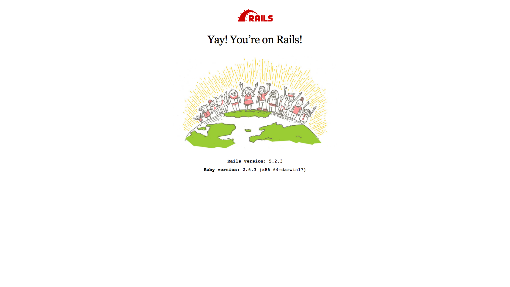

# Generate a new Rails project

```bash
$ rails new todo_api -T -d postgresql --api -C -M --skip-active-storage
$ cd todo_api
```
  * `-d` : Preconfigure for selected database (postgresql)
  * `-M` : Skip Action Mailer files
  * `-C` : Skip Action Cable files
  * `--skip-active-storage`: Skip Action Storage files
  * `-T` : Skip test files (we are going to use `RSpec` instead of `Minitest`)

# Add some additional dependencies

* [rubocop](https://github.com/rubocop-hq/rubocop): static code analyzer and formatter
* [rspec-rails](https://github.com/rspec/rspec-rails): testing framework
* [shoulda_matchers](https://github.com/thoughtbot/shoulda-matchers): simple one-liner tests for common Rails functionality
* [factory_bot_rails](https://github.com/thoughtbot/factory_bot): test fixtures
* [database_cleaner](https://github.com/DatabaseCleaner/database_cleaner): ensure a clean state for testing

add them to the Gemfile:

```ruby
# Gemfile

group :development, :test do
  gem 'rubocop'
  gem 'rspec-rails'
end

group :test do
  gem 'factory_bot_rails'
  gem 'shoulda-matchers'
  gem 'database_cleaner'
end
```

and run

```bash
$ bundle install
```

## rspec

```bash
$ bin/rails generate rspec:install
```

This generates following files which are used for configuration:

* `.rspec`
* `spec/spec_helper.rb`
* `spec/rails_helper.rb`

## shoulda_matchers, factory_bot, database_cleaner

```bash
$ mkdir spec/factories
$ touch spec/factories/.keep
```

In `spec/rails_helper.rb`:

```ruby
# spec/rails_helper.rb

# require dependencies at the top level
require 'rspec/rails'
require 'database_cleaner'
require 'shoulda-matchers'
require 'factory_bot_rails'

# [...]
# configure shoulda matchers to use rspec as the test framework and full matcher libraries for rails
Shoulda::Matchers.configure do |config|
  config.integrate do |with|
    with.test_framework :rspec
    with.library :rails
  end
end

# [...]
RSpec.configure do |config|
  # [...]
  # add `FactoryBot` methods
  config.include FactoryBot::Syntax::Methods

  # start by truncating all the tables but then use the faster transaction strategy the rest of the time.
    config.before(:suite) do
    DatabaseCleaner.clean_with(:truncation)
    DatabaseCleaner.strategy = :transaction
  end

  # start the transaction strategy as examples are run
  config.around(:each) do |example|
    DatabaseCleaner.cleaning do
      example.run
    end
  end
  # [...]
end
```

## rubocop

add `.rubocop.yml`:

```yaml
# .rubocop.yml

AllCops:
  TargetRubyVersion: 2.6
  Exclude:
    - 'db/schema.rb'
    - 'bin/*'

Metrics/BlockLength:
  ExcludedMethods: ['describe', 'context']

Metrics/LineLength:
  Max: 130

Rails:
  Enabled: true

Style/Documentation:
  Enabled: false
```

and run

```bash
$ rubocop -a
```

## the Rails command line

```bash
$ bin/rails -h
```

```
The most common rails commands are:
 generate     Generate new code (short-cut alias: "g")
 console      Start the Rails console (short-cut alias: "c")
 server       Start the Rails server (short-cut alias: "s")
 test         Run tests except system tests (short-cut alias: "t")
 test:system  Run system tests
 dbconsole    Start a console for the database specified in config/database.yml
              (short-cut alias: "db")

 new          Create a new Rails application. "rails new my_app" creates a
              new application called MyApp in "./my_app"


All commands can be run with -h (or --help) for more information.
In addition to those commands, there are:

Rails:
  console
  credentials:edit
  credentials:show
  dbconsole
  destroy
  encrypted:edit
  encrypted:show
  generate
  new
  runner
  secrets:edit
  secrets:setup
  secrets:show
  server
  test
  version

Rake:
  about
  active_storage:install
  app:template
  app:update
  db:create
  db:drop
  db:environment:set
  db:fixtures:load
  db:migrate
  db:migrate:status
  db:rollback
  db:schema:cache:clear
  db:schema:cache:dump
  db:schema:dump
  db:schema:load
  db:seed
  db:setup
  db:structure:dump
  db:structure:load
  db:version
  dev:cache
  initializers
  log:clear
  middleware
  notes
  notes:custom
  restart
  routes
  secret
  spec
  stats
  time:zones[country_or_offset]
  tmp:clear
  tmp:create
  yarn:install
```

## create the database

```bash
$ bin/rails db:create
```

## run the server

```bash
$ bin/rails s # short for server
```

visit `lvh.me:3000`


