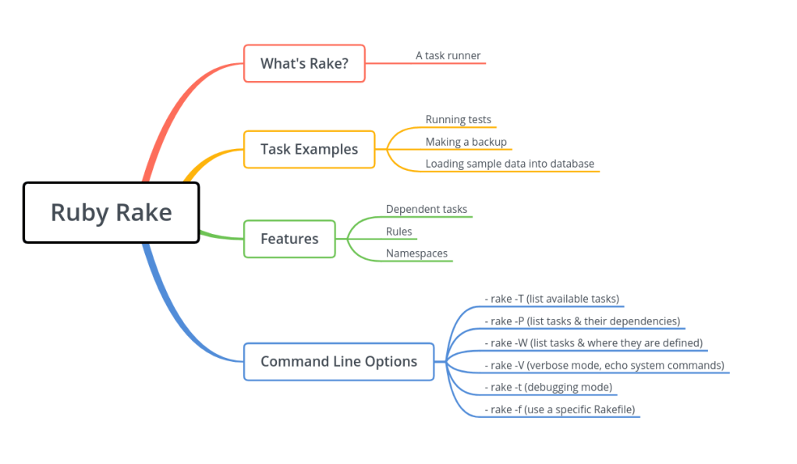
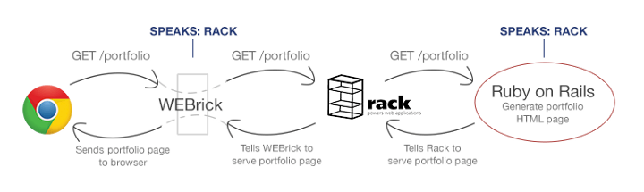
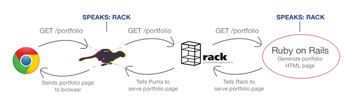
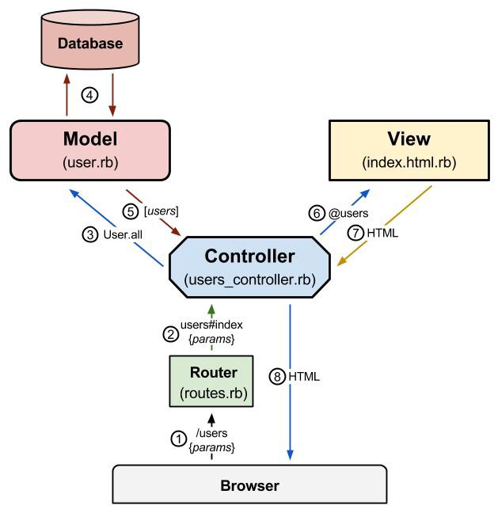

# Rake



# Rack

Rack is the underlying technology behind nearly all of the web frameworks in the Ruby world. `Rack` is actually a few different things:

* an architecture - Rack defines a very simple interface, and any code that conforms to this interface can be used in a Rack application. This makes it very easy to build small, focused, and reusable bits of code and then use Rack to compose these bits into a larger application.
* a ruby gem - Rack is is distributed as a Ruby gem that provides the glue code needed to compose our code.

Rack defines a very simple interface. Rack compliant code must have the following three characteristics:

* it must respond to call
* the call method must accept a single argument. This argument is typically called env or environment, and it bundles all of the data about the request.
* the call method must return an array of three elements. These elements are, in order, status for the HTTP status code, headers, and body for the actual content of the response.

```ruby
# rack hello world

require 'rack'
require 'thin'

class HelloWorld
  def call(env)
    [ 200, { 'Content-Type' => 'text/plain' }, ['Hello World'] ]
  end
end

Rack::Handler::Thin.run HelloWorld.new
```

Rack is the glue between the webserver and the framework:





# Rails

* MVC, convention over configuration
* [great article on the rails request/response Cycle](https://www.rubypigeon.com/posts/examining-internals-of-rails-request-response-cycle/)



