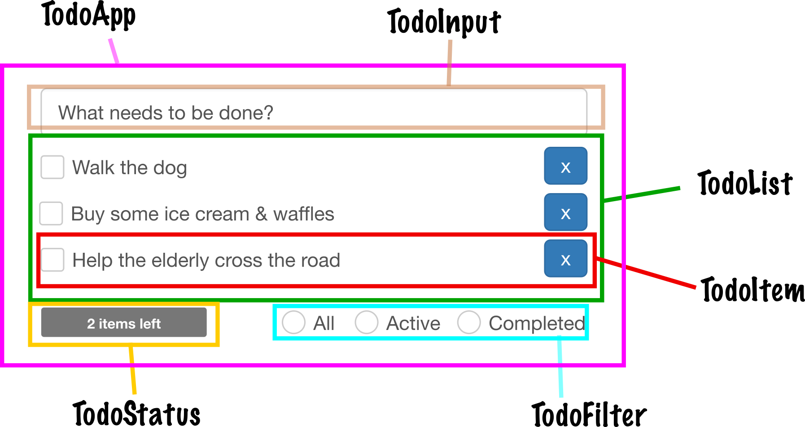

# Planning our components

We've got much of the boilerplate ready and it is time for us now to make a rough draft of the components used in our application. Most applications start with a root component that ties everything together while nested components comprise the bits and bobs that make up our user interface.

## TodoApp

This is the component that represents our entire application. React needs a single top level component to kick things off which also gives us a convenient place to put any sort of state that is global to the application. In this case we are going to store the list of elements here as component state and pass the items as a property to `TodoList` later on.

## TodoInput

Simple text field for creating new to-do items. Pressing Enter will create the to-do item and clear the field. Does not hold much state other than the text that is being entered.

## TodoList

Container element for our to-do items. Holds a list of elements as a property.

## TodoItem

One of the more complicated composite components. Has a checkbox for toggling completed state - completing a task will display item text with a strikethrough style. Also has the actual text and a delete button. State is comprised of a completed flag and item text.

## TodoStatus

Shows how many items are in completed state.

## TodoFilter

Provides filters for to-do items. "All" should display all items regardless whether they are completed or not. "Active" should display items that need to be completed. "Completed" shows only finished items.