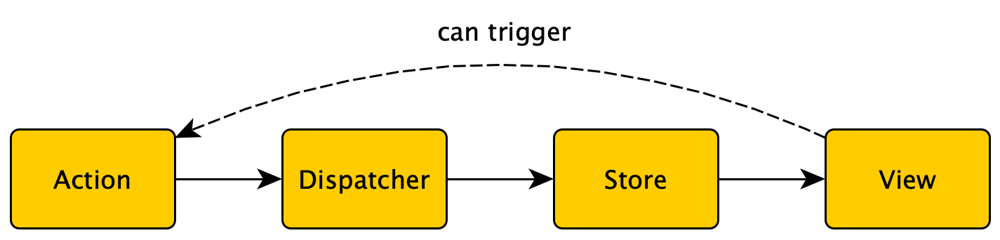

# Flux architecture and the application state

Flux is an application architecture invented by Facebook for building client-side web applications. It is more like a pattern than a framework in which data flows in one direction.

Major parts of an application that adheres to the Flux architecture principles:
* Views - retrieves data from the store and display them.
* Action - essentially events that can change application state as a consequence of them being disptached. Created by action helpers in most cases they contain pure data that describes the action in its simplest form.
* Stores - contains the state that can be mutated by the consequence of actions that are submitted through the dispatcher. The only way to mutate the store is to dispatch actions.
* Dispatcher - when the user interacts with a Flux application the view propagates action through a central dispatcher which in turn will effect changes in the store.

The undirectional flow can be described as follows:


Actions are triggered by user interaction or asynchronous events which then get submitted to a dispatcher that notifies the store which in turn modifies its state and also notifies the views that are interested in its state.

One of the popular implementations of Flux is the Redux library which we are going to use in this workshop. Add it to your application dependencies by issuing:

```
$ npm install --save redux
```

# Application state

For the sake of this tutorial and for illustrating they way Redux works we are going to design our application state in advance. For more complicated projects with lots of features this could prove to be quite cumbersome but the simple nature of our application and requirements makes it possible to do so. Most projects evolve their state organically.

Create a directory named `reducers` and create a file named `index.ts` then start with adding the following contents:

```typescript
import { TodoFilterState } from "../components/TodoFilter";

export type AppState = {
    ui: {
        textInput: string;
        filterState: TodoFilterState;
    },
    todos: TodoItem[];
    lastId: number;
};

const initialState: AppState = {
    ui: {
        textInput: '',
        filterState: TodoFilterState.ALL,
    },
    todos: [{
        id: "1",
        title: "item1",
    },
    {
        id: "2",
        title: "item2",
        completed: true,
    }],
    lastId: 2,
};
```

Our application state will be divided into two distinct parts:
* Application state - refers to the data that flows through your application - for ex. data retrieved from rest services or anything else that is needed for domain logic.
* *UI state* - values directly correspond to some part of the user interface. Can be the value of a text field, the expanded/closed status of a header, etc.

In this particular example the application state contains the following:
* *todos* - a list of all the to-do items that we are currently aware of. This list will mutate depending on what actions we dispatch (addTodo, toggleTodo, deleteTodo). It will also get updated with the data that we will retrieve from a to-do list REST API service.
* *lastId* - we are going to make note of that last ID we had used in order to be able to create new items with a unique ID. This is just a temporary member as when we integrate with the REST backend the server is going to assign the item ID for us.

The user interface state is the following:
* *textInput* - contains the entered text of the to-do text input. Every single update in that text field will be reflected in this variable.
* *filterState* - the currently active filter state which gets set by clicking on the radio buttons of the filter component. 

Every application starts with an initial state which in this case we predefined to be:
* An empty to-do text input
* Filter set to show all items
* Two simple to-do items to serve as example data
* The last id set to `2` as that was the ID of the last item. 
 
# Actions

In order to mutate state we need to create some actions. Create a directory named `actions` and put a file named `index.ts` in this directory with the following contents:

```typescript
import { TodoFilterState } from "../components/TodoFilter";

export const SET_TODO_TEXT_INPUT = 'SET_TODO_TEXT_INPUT';
export const SET_TODO_FILTER_STATE = 'SET_TODO_FILTER_STATE';
export const ADD_TODO = 'ADD_TODO';
export const TOGGLE_TODO = 'TOGGLE_TODO';
export const DELETE_TODO = 'DELETE_TODO';

type SetTodoTextInputAction = {
    type: typeof SET_TODO_TEXT_INPUT;
    textInput: string;
};

type SetTodoFilterStateAction = {
    type: typeof SET_TODO_FILTER_STATE;
    filterState: TodoFilterState;
};

type AddTodoAction = {
    type: typeof ADD_TODO;
};

type ToggleTodoAction = {
    type: typeof TOGGLE_TODO;
    id: string;
};

type DeleteTodoAction = {
    type: typeof DELETE_TODO;
    id: string;
};

export type AppAction = 
    SetTodoTextInputAction | 
    SetTodoFilterStateAction | 
    AddTodoAction | 
    ToggleTodoAction | 
    DeleteTodoAction;

export const setTodoTextInput = (textInput: string): AppAction => ({
    type: SET_TODO_TEXT_INPUT,
    textInput,
})

export const setTodoFilterState = (filterState: TodoFilterState): AppAction => ({
    type: SET_TODO_FILTER_STATE,
    filterState,
})

export const addTodo = (): AppAction => ({
    type: ADD_TODO,
});

export const toggleTodo = (id: string): AppAction => ({
    type: TOGGLE_TODO,
    id,
});

export const deleteTodo = (id: string): AppAction => ({
    type: DELETE_TODO,
    id,
});
```

In order to distinguish actions between each other we are going to use a `type` field. The value of this type field can only be one of the constants we define at the beginnging of the file.

To make good use of the type-checking capabilities we are going to define a type for each of the actions.

The `SetTodoTextInputAction` sets the currently entered to-do text to the value specified in the action. Every time you can change value of the text field this action will get dispatched.

The `SetTodoFilterStateAction` will set the currently active filter criteria for the application. Clicking on the radio buttons will dispatch this action wilth the value corresponding to the selected button. 

The `AddTodoAction` action when dispatched will add a to-do item with currently entered text then clears that text. Essentially, it queries and the modifies the `ui.textInput` field in the UI state.

The `ToggleTodoAction` action will toggle the `completed` field of the to-do item specified by the item ID included in this action.

The `DeleteTodoAction` action will delete the to-do item specified by the provided ID.

The `AppAction` type which follow these actions is a union type - when a variable or member is declared to be of this type the compiler only allows one of these types to be assigned to it. 

In order to make creating instances of these action a bit easier a function for instantiating each of these types are provided and exported in this module.

# Reducers

Reducers determine how the application state should change based on the current state and the action dispatched. They are essentially pure functions - ideally they derive their return value strictly from their paramters only with no global state - that take the current state with the action being dispatched and return the new state to be used. When changes are made we always make a copy of the current state, do our modifications then return the new instance. In cases when there are no mutations to be done, the reducer just returns the current state without any modifications.

Based on the actions we have outlined previously we should make the following additions to the `reducers/index.ts` file:

Import all the other constants and symbols we are going to use in this file:

```typescript
import { AppAction, SET_TODO_TEXT_INPUT, ADD_TODO, TOGGLE_TODO, DELETE_TODO, SET_TODO_FILTER_STATE } from "../actions";
import { TodoItem } from "../model/todoItem";
import { TodoStatus } from "../components/TodoStatus";
```

Append to the end of the file with the implementation of our reducer:

```typescript
export const appReducer = (state: AppState = initialState, action: AppAction): AppState => {
    switch (action.type) {
        case SET_TODO_TEXT_INPUT:
            return {...state, ui: {...state.ui, textInput: action.textInput}};
        case SET_TODO_FILTER_STATE:
            return {...state, ui: {...state.ui, filterState: action.filterState}};
        case ADD_TODO:
            return {
                ...state, 
                ui: {...state.ui, textInput: ''},
                todos: [...state.todos, {
                    id: (state.lastId + 1).toString(),
                    title: state.ui.textInput,
                    completed: false,
                }],
                lastId: state.lastId + 1,
            };
        case TOGGLE_TODO:
            return {
                ...state,
                todos: state.todos.map((todo) => {
                    if (todo.id === action.id) {
                        return {...todo, completed: !todo.completed}
                    } else {
                        return todo;
                    }
                }),
            };
        case DELETE_TODO:
            return {
                ...state,
                todos: state.todos.filter(todo => todo.id !== action.id),
            };
        default:
            return state;
    }
} 
``` 

As the first order of business we check the type of the action being dispatched. When dispatching the `SetTodoTextInput` action the reducers needs to make a copy your current state and then modify only the `ui.textInput` field with the value contained in the action. While there are many libraries for creating immutable copies of objects with specific alterations we opted to use a built-in feature of ES2015 called the spread operator (`...`). This operator, when used in object literals will expand the fields of the specified unary operand into the object that it is invoked upon. For example the expression `{...someobj1, ...someobj2, a: 5}` will yield an object that has all the fields from `someobj1`, `someobj2` and finally the value of the `a` field wield be set to `5`. Do note that order is important - fields will be copied into the new object in the sequence you have specfied meaning that if the spread objects have fields with the same name, the last object's value with that field will win and whatever else you do later in the object literal expression has the potential to overwrite previously merged values. In some cases this is exactly what we want as our current objective is to copy the previous state then make some minor modifications.

The `SetTodoFilterState` action behaves much the same as in the previous paragraph. We only need to make changes to the `ui.filterState` field - everything else should be copied as is.

The first action to get a little bit more involved is `AddTodo` - it modifies both UI state and application state. As previously mentioned it should achieve the following things:
* Create a new to-do item with the specified text with a unique id.
* Clear the to-do text input.
* Update the counter used for the unique IDs.

Preserving the state of every object and array in the state is important, that is why we needed to use multiple spread operators in this case.

Dispatching `ToggleTodo` should modify the `completed` field of the item specified in the action. Invoking the `Array.map()` function on the list is a simple way to copy all the items and modify the specified one we need.

Our intention with the `DeleteTodo` action is to remove a single item from the list of items. This can be easily achieved with the `Array.filter()` built-in function.

Lastly, the default case just returns the current state without any modifications. It is safe to do so when the object is completely untouched. 

In this example we have created a single, central reducer function but with larger projects we frequently create distinct reducers for separate parts of application state then combine them into a single reducer. See [combineReducers()](https://redux.js.org/api/combinereducers) for more information.

# Store

Finally, we are going to set up our store in a separate module and write some test cases for it.

Create a directory named `store` and put a file named `index.ts` in it with the following contents:

```tsx
import { createStore } from 'redux';
import {appReducer, AppState} from "../reducers";

export const createAppStore = (initialState: AppState) => createStore(appReducer, initialState);
``` 

Creating a store is not ceremonious - you just need to provide your reducer and optionally an initial state for the store.

In the same directory `store` directory create another file named `index.test.ts`:

```tsx
import 'jest-dom/extend-expect';

import {addTodo, deleteTodo, setTodoFilterState, setTodoTextInput, toggleTodo} from '../actions'
import {createAppStore} from '.';
import {TodoFilterState} from "../components/TodoFilter";
import {AppState} from "../reducers";

const testState = (expandWith: any): AppState => ({
    ui: {
        textInput: '',
        filterState: TodoFilterState.ALL,
    },
    todos: [],
    lastId: 0,
    ...expandWith
});

describe('AppStore', () => {

    it('setTodoTextInput sets text input state correctly', async () => {
        const store = createAppStore(testState({
            ui: {
                textInput: "original",
            }
        }));

        expect(store.getState().ui.textInput).toBe("original");

        store.dispatch(setTodoTextInput("barackfa"));

        expect(store.getState().ui.textInput).toBe("barackfa");
    });

    it('setTodoFilterState set filter state correctly', async () => {
        const store = createAppStore(testState({
            ui: {
                filterState: TodoFilterState.ALL
            }
        }));

        expect(store.getState().ui.filterState).toBe(TodoFilterState.ALL);

        store.dispatch(setTodoFilterState(TodoFilterState.ACTIVE));

        expect(store.getState().ui.filterState).toBe(TodoFilterState.ACTIVE);
    });

    it('addTodo adds item correctly', async () => {
        const store = createAppStore(testState({
            todos: []
        }));

        expect(store.getState().todos).toHaveLength(0);

        store.dispatch(setTodoTextInput("barackfa"));
        store.dispatch(addTodo());

        expect(store.getState().todos).toHaveLength(1);
        expect(store.getState().todos[0]).toEqual({
            id: "1",
            title: "barackfa",
            completed: false
        });
    });

    it('toggleTodo toggles item correctly', async () => {
        const store = createAppStore(testState({
            todos: [{
                id: "1",
                title: "item",
                completed: false
            }]
        }));

        expect(store.getState().todos[0].completed).toBeFalsy();

        store.dispatch(toggleTodo("1"));

        expect(store.getState().todos[0].completed).toBeTruthy();
    });

    it('deleteTodo deletes item correctly', async () => {
        const store = createAppStore(testState({
            todos: [{
                id: "1",
                title: "item",
                completed: false
            }]
        }));

        expect(store.getState().todos).toHaveLength(1);

        store.dispatch(deleteTodo("1"));

        expect(store.getState().todos).toHaveLength(0);
    });

});
```

As you can see, most of these tests presume a know initial state, dispatch an action and assert on the changes that have been effected by these actions.